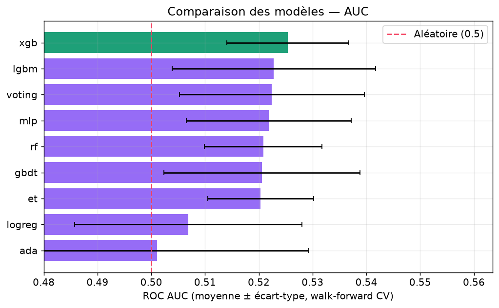
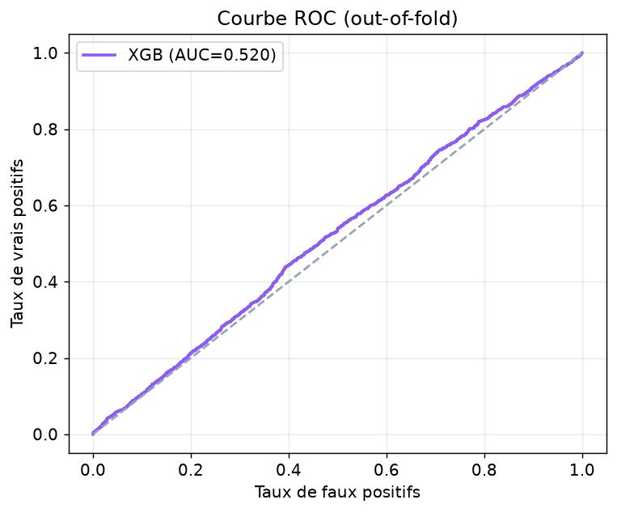
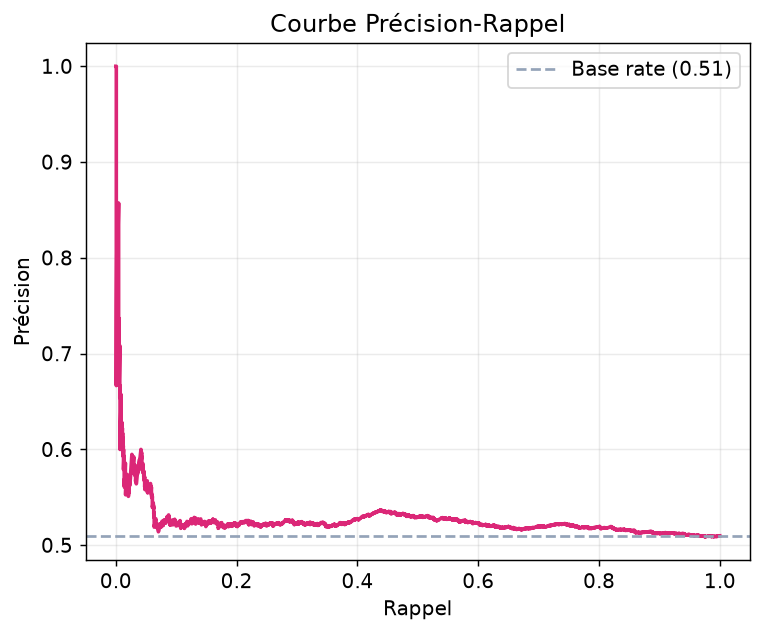
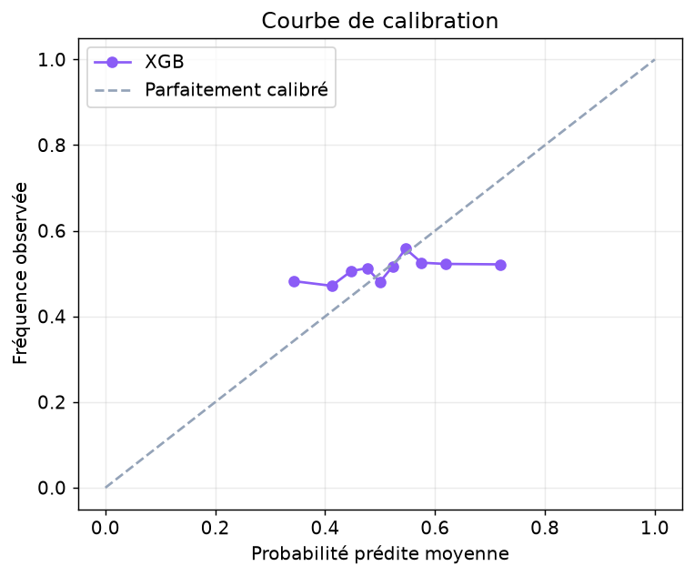
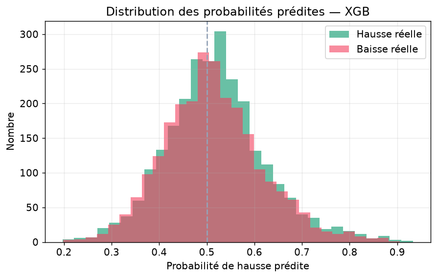
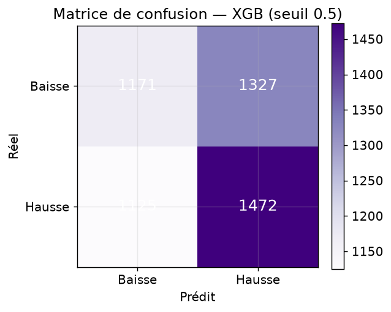
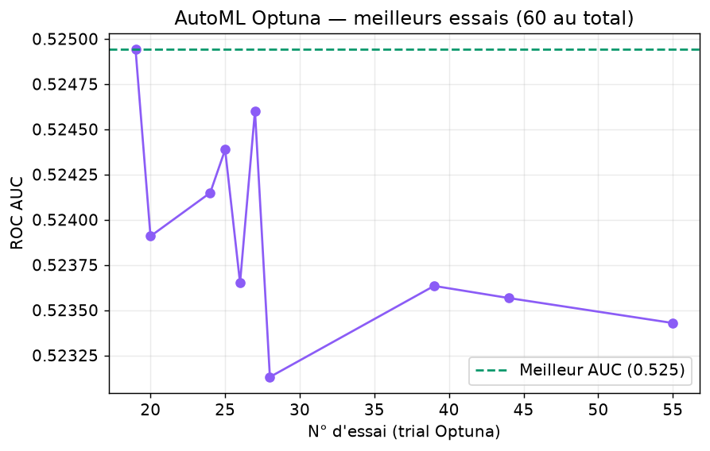
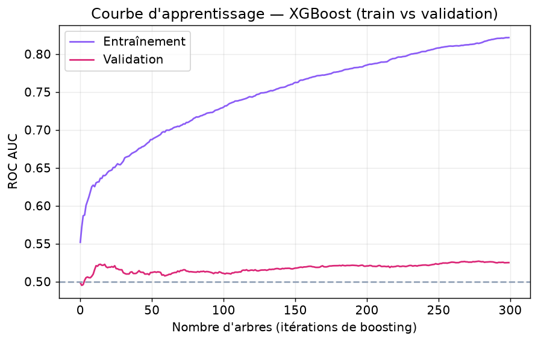
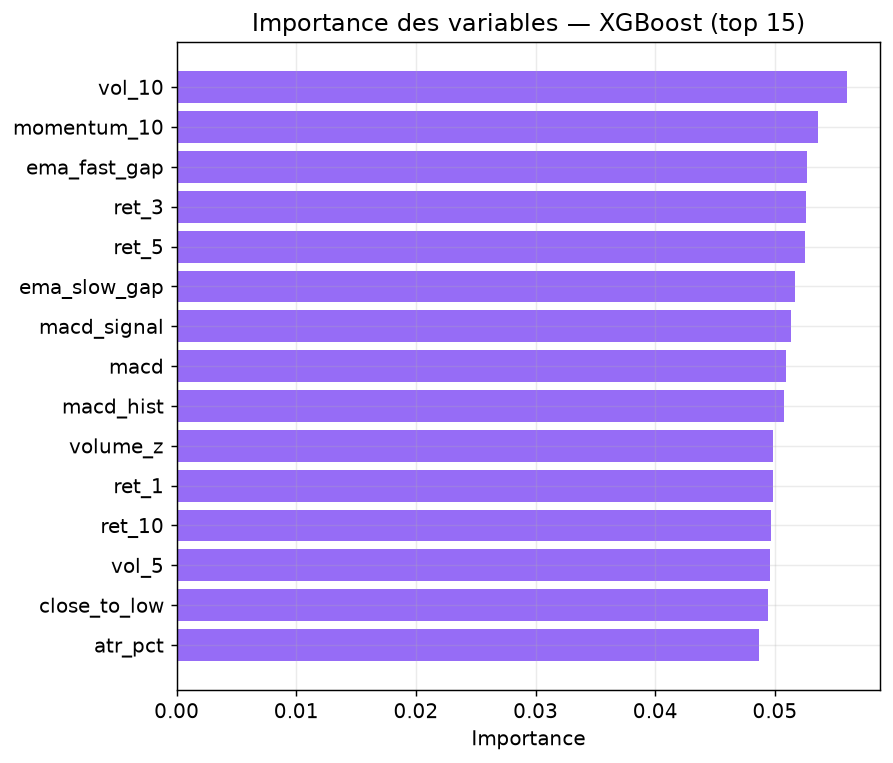
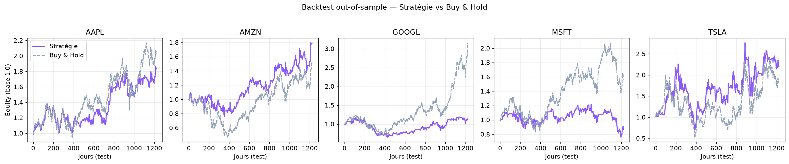

# MarketPilot — Plateforme Cloud d'Analyse Temps Réel des Marchés Financiers

**Rapport de projet — module Cloud / Big Data, 2026**

> Plateforme complète de collecte, traitement, prédiction et visualisation de données
> boursières temps réel, déployable en local (Docker) ou sur AWS.
> **Pipeline :** `Finnhub → Producer → Kafka → Consumer → CSV/S3 → Dashboard Streamlit + ML`

---

## Sommaire

1. [Contexte et objectifs](#1-contexte-et-objectifs)
2. [Architecture générale](#2-architecture-générale)
3. [Chaîne de données temps réel](#3-chaîne-de-données-temps-réel)
4. [Modélisation Machine Learning](#4-modélisation-machine-learning)
   - 4.1 [Données, cible et variables](#41-données-cible-et-variables)
   - 4.2 [Comparaison des modèles](#42-comparaison-des-modèles)
   - 4.3 [Pouvoir discriminant : ROC et précision-rappel](#43-pouvoir-discriminant--roc-et-précision-rappel)
   - 4.4 [Calibration et distribution des probabilités](#44-calibration-et-distribution-des-probabilités)
   - 4.5 [Matrice de confusion](#45-matrice-de-confusion)
   - 4.6 [Optimisation AutoML (Optuna)](#46-optimisation-automl-optuna)
   - 4.7 [Courbe d'apprentissage et importance des variables](#47-courbe-dapprentissage-et-importance-des-variables)
5. [Backtest out-of-sample](#5-backtest-out-of-sample)
6. [Dashboard et fonctionnalités applicatives](#6-dashboard-et-fonctionnalités-applicatives)
7. [Déploiement AWS](#7-déploiement-aws)
8. [Sécurité](#8-sécurité)
9. [Résultats, limites et perspectives](#9-résultats-limites-et-perspectives)

---

## 1. Contexte et objectifs

L'objectif du projet est de fournir, via une architecture cloud scalable, une solution
**temps réel** d'analyse et de prédiction sur des flux boursiers : accessible, fiable et
facilement déployable. Le périmètre couvre toute la chaîne de valeur, de l'**ingestion**
des cotations jusqu'à la **décision d'investissement assistée par IA**, en passant par le
**traitement en flux**, la **modélisation ML** et la **restitution** dans un dashboard
interactif.

Trois exigences ont structuré la conception :

- **Temps réel** : les cotations doivent transiter par un bus de messages (Kafka) et être
  enrichies au fil de l'eau, avec un mécanisme de repli (fallback CSV) garantissant la
  continuité de service.
- **Rigueur méthodologique** en ML : validation *walk-forward* (respect de l'ordre
  temporel), comparaison systématique de plusieurs familles de modèles, et **backtest
  out-of-sample avec coûts de transaction** pour mesurer la valeur économique réelle du
  signal, au-delà des métriques de classification.
- **Portabilité** : lancement en une commande via `docker compose`, et déploiement AWS
  documenté (EC2, S3, SageMaker, Athena, CloudWatch).

---

## 2. Architecture générale

```
[API Finnhub]
     │
     ▼
[Producer] ──► [Kafka (+ ZooKeeper + Kafka UI)] ──► [Consumer] ──► CSV / S3
                                                          │
                                                          ▼
                                          [Dashboard Streamlit + ML]
                                                          │
                                     ┌────────────────────┼────────────────────┐
                                     ▼                     ▼                     ▼
                              [Alertes email]      [Recommandations]      [Signal IA]
```

**Chaîne ML (offline + inférence locale)**

```
[yfinance OHLCV] ──► [S3 training-data] ──► [SageMaker Training Job (SKLearn)]
                                                    │
                                                    ▼
                                       [S3 model-artifacts/model.tar.gz]
                                                    │
                                                    ▼
                              [EC2 dashboard : direction_model.joblib → inférence locale]
```

Le choix d'une **inférence locale** (chargement de `direction_model.joblib` par le
dashboard) plutôt qu'un endpoint SageMaker permanent évite tout coût de serving continu,
tout en conservant l'entraînement managé et scalable sur SageMaker.

---

## 3. Chaîne de données temps réel

| Composant | Rôle |
|---|---|
| **Producer** | Récupère les cotations Finnhub, publie sur Kafka (topic `market.quotes.raw`), backup CSV, *rate-limiting* et déduplication. |
| **Kafka** | Transport temps réel résilient (Kafka + ZooKeeper + Kafka UI via docker-compose). |
| **Consumer** | Nettoie et enrichit chaque tick (`delta_abs`, `delta_pct`, `direction`), écrit `processed_quotes.csv`, avec **fallback CSV** si Kafka est silencieux. |
| **Dashboard** | Visualisation, ML, recommandations, alertes, authentification (Streamlit multi-pages). |
| **Worker d'alertes** | Service autonome qui envoie les emails sur seuils, sans qu'un utilisateur soit connecté. |

Chaque message publié contient le symbole, les prix (`current`, `high`, `low`, `open`,
`previous_close`), l'horodatage Finnhub, l'horodatage d'ingestion et la source.

---

## 4. Modélisation Machine Learning

### 4.1 Données, cible et variables

- **Historique** : OHLCV quotidien via yfinance sur **5 ans**, pour 5 valeurs
  (`AAPL`, `MSFT`, `TSLA`, `GOOGL`, `AMZN`).
- **Cible** : direction du prix à l'horizon **1 jour**, avec un seuil de neutralité de
  **5 bps** (`threshold_bps = 5.0`) — problème de **classification binaire**
  (hausse / baisse).
- **Variables** : indicateurs techniques dérivés des séries (rendements décalés,
  moyennes mobiles, volatilité, RSI, etc. — voir `src/ml/features.py`).
- **Validation** : *walk-forward cross-validation* à **5 splits**, qui respecte l'ordre
  chronologique et interdit toute fuite d'information du futur vers le passé.

### 4.2 Comparaison des modèles

Neuf modèles ont été comparés sur la même validation walk-forward. La métrique de
référence est la **ROC AUC moyenne** (± écart-type inter-folds).



| Rang | Modèle | ROC AUC | Accuracy | F1 | Log-loss |
|---|---|---|---|---|---|
| 1 | **XGBoost** ⭐ | **0.5254 ± 0.011** | 0.5187 | 0.5447 | 0.7101 |
| 2 | LightGBM | 0.5228 ± 0.019 | 0.5113 | 0.5293 | 0.7108 |
| 3 | Voting | 0.5224 ± 0.017 | 0.5134 | 0.5386 | 0.7093 |
| 4 | MLP | 0.5218 ± 0.015 | 0.5144 | 0.5544 | 0.7038 |
| 5 | Random Forest | 0.5208 ± 0.011 | 0.5152 | 0.5305 | 0.6949 |
| 6 | GBDT | 0.5206 ± 0.018 | 0.5207 | 0.5489 | 0.7126 |
| 7 | Extra Trees | 0.5203 ± 0.010 | 0.5123 | 0.5249 | 0.6931 |
| 8 | LogReg | 0.5068 ± 0.021 | 0.5093 | 0.5196 | 0.7003 |
| 9 | AdaBoost | 0.5011 ± 0.028 | 0.5038 | 0.5530 | 0.7560 |

**Lecture.** Le meilleur modèle retenu est **XGBoost** (AUC ≈ 0.525). Tous les modèles se
situent légèrement au-dessus du hasard (0.5), ce qui est **attendu et sain** pour de la
prédiction de direction quotidienne : un AUC massivement supérieur à 0.5 sur ce type de
cible signalerait une fuite de données plutôt qu'un vrai signal. Les modèles à base
d'arbres boostés (XGBoost, LightGBM) dominent légèrement la régression logistique et
AdaBoost.

### 4.3 Pouvoir discriminant : ROC et précision-rappel

Les courbes suivantes sont calculées **out-of-fold** (prédictions hors échantillon
d'entraînement) sur le meilleur modèle.



La courbe ROC se tient au-dessus de la diagonale aléatoire, confirmant un pouvoir
discriminant faible mais réel et cohérent avec l'AUC de 0.525.



La courbe précision-rappel se compare à la *base rate* (proportion de hausses). L'écart
positif, quoique modeste, indique que le modèle apporte une information au-delà de la
simple fréquence de base des hausses.

### 4.4 Calibration et distribution des probabilités



La **calibration** mesure si une probabilité prédite de, par exemple, 0.6 correspond bien
à ~60 % de hausses observées. Une courbe proche de la diagonale signifie que les
probabilités sont **fiables** — condition essentielle pour piloter des seuils de décision
(alertes, recommandations) et un backtest.



La distribution des probabilités prédites, séparée selon l'issue réelle (hausse / baisse),
montre un **léger décalage** des probabilités vers la droite pour les hausses réelles :
c'est la traduction visuelle du signal faible mais exploitable.

### 4.5 Matrice de confusion



Au seuil neutre de 0.5, la matrice de confusion résume les vrais/faux positifs et
négatifs. Elle confirme une accuracy d'environ **52 %**, cohérente avec le tableau
comparatif. Le vrai enjeu n'est pas ce seuil symétrique mais le **choix d'un seuil de
décision** adapté à la stratégie (cf. backtest à seuil 0.55).

### 4.6 Optimisation AutoML (Optuna)

Une recherche automatique d'hyperparamètres a été menée avec **Optuna** (60 essais).



- **Meilleur essai** : #19, **AUC = 0.5249**
- **Modèle** : Extra Trees (`n_estimators=124`, `max_depth=8`, `min_samples_leaf=16`)
- **Essais** : 60

L'AutoML converge vers un AUC (≈ 0.525) du même ordre que XGBoost entraîné manuellement,
ce qui **confirme la robustesse du plateau de performance** : le levier d'amélioration
n'est pas l'hyperparamétrage mais le **cadrage du problème** (horizon, features, cible).

### 4.7 Courbe d'apprentissage et importance des variables



La courbe d'apprentissage (AUC train vs validation en fonction du nombre d'arbres) permet
de diagnostiquer le **sur-apprentissage** : l'AUC d'entraînement continue de monter tandis
que l'AUC de validation plafonne, ce qui justifie une profondeur limitée (`max_depth=3`)
et une régularisation par sous-échantillonnage.



Le classement des variables (top 15 par importance XGBoost) indique quels indicateurs
techniques portent le plus de signal, et oriente le travail futur de *feature engineering*.

---

## 5. Backtest out-of-sample

Au-delà des métriques de classification, un **backtest** mesure la valeur économique du
signal. Protocole : entraînement sur **5 ans** (2016–2021), test out-of-sample sur
**2021-06-17 → 2026-04-30**, seuil de décision **0.55**, coûts de transaction **2 bps**
par trade. La stratégie est comparée à un **Buy & Hold**.



| Symbole | Rdt stratégie | Rdt Buy & Hold | Sharpe strat. | Sharpe B&H | Max DD strat. | Max DD B&H | Hit rate | Trades |
|---|---|---|---|---|---|---|---|---|
| AAPL | +83.8 % | +105.9 % | 0.68 | 0.68 | −27.2 % | −33.4 % | 53.0 % | 265 |
| MSFT | −13.2 % | +56.3 % | −0.01 | 0.48 | −37.7 % | −37.6 % | 50.3 % | 249 |
| TSLA | **+119.9 %** | +85.7 % | 0.58 | 0.51 | −69.3 % | −73.6 % | 54.7 % | 304 |
| GOOGL | +13.6 % | +216.1 % | 0.23 | 0.91 | −44.3 % | −44.3 % | 52.9 % | 284 |
| AMZN | +78.4 % | +51.9 % | 0.58 | 0.42 | −30.6 % | −56.1 % | 50.5 % | 396 |

**Lecture.** Les résultats sont **contrastés** et honnêtes :

- Sur **TSLA** et **AMZN**, la stratégie **bat le Buy & Hold** en rendement *et* en Sharpe,
  tout en **réduisant le drawdown maximal** (protection en marché baissier grâce à
  l'exposition partielle).
- Sur **GOOGL** et **MSFT**, elle **sous-performe** nettement : le modèle rate une partie
  des fortes tendances haussières (le coût d'être hors marché).
- La **réduction du drawdown** est le bénéfice le plus systématique (AAPL, TSLA, AMZN),
  cohérent avec une exposition moyenne de ~55–65 % du temps.

Conclusion économique : le signal a une **valeur défensive** réelle (moindre drawdown,
meilleur Sharpe sur certaines valeurs) mais **ne surperforme pas de façon systématique** —
ce qui est un résultat crédible et non sur-vendu pour un signal quotidien.

---

## 6. Dashboard et fonctionnalités applicatives

Dashboard **Streamlit multi-pages** :

| Page / module | Description |
|---|---|
| **Accueil / Tendances** | Vue de marché, cotations et indicateurs. |
| **Opportunités / Signal IA** | Probabilités de hausse par valeur, issues du modèle. |
| **Recommandations** | Profil de risque adaptatif (feedback utilisateur), métriques (volatilité, Sharpe, drawdown). |
| **Coach IA / Assistant LLM** | Passerelle configurable OpenAI / Anthropic / Groq. |
| **Alertes** | Notifications email automatiques sur seuils de probabilité ML (worker autonome, anti-spam). |
| **Activité pipeline** | Supervision de la chaîne d'ingestion. |
| **Mon compte** | Authentification (login/signup), préférences par utilisateur. |

---

## 7. Déploiement AWS

- **EC2** : instances pour Kafka, producer/consumer et dashboard (services systemd +
  docker-compose).
- **S3** : données brutes/traitées et artefacts de modèle (`model-artifacts/model.tar.gz`).
- **SageMaker** : Training Jobs à la demande (container SKLearn, `ml.m5.large`), walk-forward
  CV et sélection automatique du meilleur modèle.
- **Athena** : requêtes SQL sur les données S3.
- **CloudWatch** : logs et monitoring.

Le projet est également **dockerisé** : `docker compose up` lance l'ensemble en une commande.

---

## 8. Sécurité

- Mots de passe hachés en **PBKDF2-HMAC-SHA256 salé** (200 000 itérations).
- Secrets (`.env`), données utilisateurs (`users.json`) et logs d'alertes **exclus du dépôt**
  (`.gitignore`).
- Gestion des accès AWS via **IAM** (rôle SageMaker dédié, security groups EC2).

---

## 9. Résultats, limites et perspectives

**Résultats clés**

- Chaîne temps réel complète et résiliente (Kafka + fallback CSV), déployable en une commande.
- Comparaison rigoureuse de **9 modèles** en walk-forward ; meilleur modèle **XGBoost**
  (AUC ≈ 0.525), confirmé par l'AutoML Optuna (AUC ≈ 0.525).
- **Backtest out-of-sample avec coûts** : valeur défensive avérée (réduction du drawdown,
  surperformance sur TSLA/AMZN), sans surperformance systématique.

**Limites**

- Le signal de direction quotidienne reste **proche du hasard** (AUC ≈ 0.52) — attendu pour
  cette cible ; le principal levier est le **cadrage** (horizon, features, définition de la
  cible), pas l'hyperparamétrage.
- Backtest sur **5 valeurs** et une seule fenêtre de test ; pas de coûts de slippage variables.

**Perspectives**

- Ré-entraînement planifié et automatisé, exposition d'une **API REST** d'inférence.
- Sources de données additionnelles (fondamentaux, sentiment, order book).
- Passage à **MSK** (Kafka managé) et à un stockage base de données pour l'historique.
- Élargissement de l'univers de valeurs et validation multi-fenêtres du backtest.


